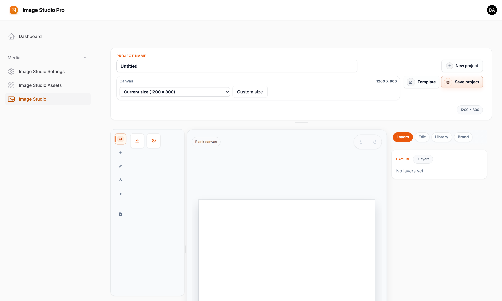
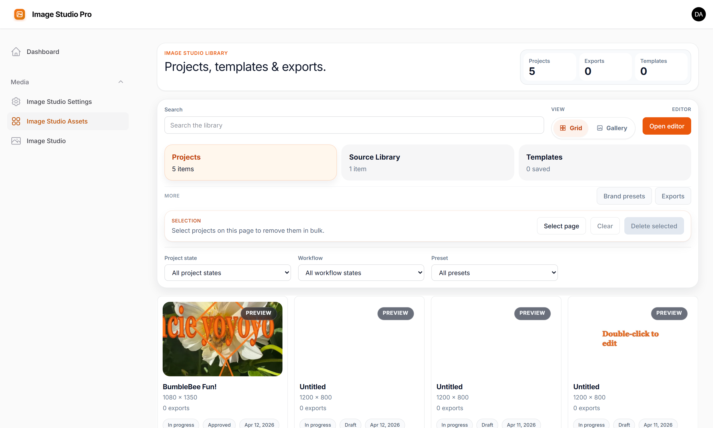
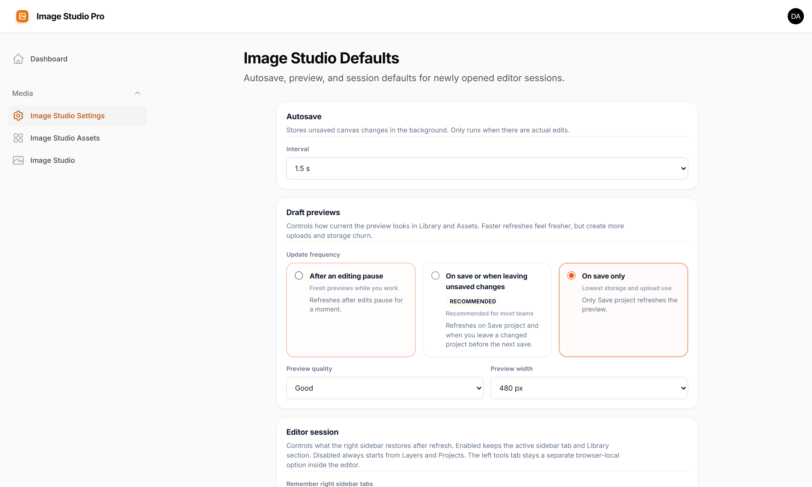

# Filament Image Studio Pro

Filament Image Studio Pro is a premium Filament plugin that gives your team a complete image production workspace inside the admin panel — no Canva, no Photoshop, no download-edit-reupload cycle.

It covers the full lifecycle: editing images on a canvas, managing a shared asset library, reviewing and approving work as a team, and handing the finished result back to any Filament form, record, or Media Library collection.

## Live demo

- Landing page: https://filament-image-studio-pro.heinerdevelops.tech
- Admin login: https://filament-image-studio-pro.heinerdevelops.tech/admin/login

## Purchase, docs, and support

- Product page and public docs: https://filament-image-studio-pro.heinerdevelops.tech
- Public GitHub docs and release notes: https://github.com/heinergiehl/filament-image-studio-pro-docs
- Support: webdevislife2021@gmail.com

## Screenshots

Editor workspace:



Library workspace:



Settings page:



## What Image Studio Pro does

Image Studio Pro adds a complete image production workflow to Filament:

- edit and compose images on a canvas with text, shapes, filters, markup tools, drawing, and layers
- manage reusable source images, templates, and brand presets in a shared library
- export renders as PNG, JPEG, or WebP and hand the result to a form field, record attribute, or Media Library
- view single images in a pan/zoom slide-over, browse a gallery with lightbox, or compare before/after images with a draggable divider — all from standard Filament actions and Livewire components
- run a full team review and approval cycle with revision history so work stays auditable

## Feature summary

### Canvas editor

- start from a blank canvas, a source image, a template, a saved project, or a built-in format preset
- crop and reposition images on the canvas
- add text layers, shape overlays, callouts, and logos
- use markup tools (lines, arrows, highlights, notes, redaction) for review images
- apply 12 image adjustments: brightness, contrast, saturation, blur, grayscale, hue rotation, vibrance, noise, pixelate, sharpen, sepia, invert
- reorder layers, replace sources, lock individual layers to protect finished elements
- undo/redo, autosave, snap guides, and draft previews
- draw freehand with pencil, circle, and spray brush types
- right-click context menu: clipboard, lock, z-order
- 30+ keyboard shortcuts
- scroll-wheel zoom, pinch zoom, zoom buttons, spacebar-drag panning
- draggable zoom toolbar — pull it anywhere within the canvas card so it never covers your work

### Image viewer and gallery

- **`ViewImageAction`** — a Filament action that opens any image URL in a pan/zoom slide-over with close button
- **`OpenMediaAction`** — opens a gallery modal for browsing, comparing, or selecting one or more images; supports selection callbacks and optional multiple-select mode
- **`PanZoomViewer`** — standalone Livewire component for pan/zoom display with configurable min/max zoom and zoom controls
- **`GalleryViewer`** — paginated Livewire gallery with lightbox, keyboard navigation, captions, and optional selectable/multi-select mode
- **`ImageCompare`** — side-by-side image comparison with a draggable divider, before/after labels, and configurable initial split position

### Asset library

- browse saved projects, source images, templates, renders, and brand presets from one page
- search and paginate large libraries
- track project state: Draft, Published, Archived
- reusable source images are kept separate from working design drafts

### Templates and brand presets

- save layouts from the editor and apply them to new projects instantly
- brand presets store colors, fonts, alignment defaults, logo assets, and text styling
- apply brand presets to new layers or restyle existing text in one click

### Team workflow

- **Approval cycle**: Draft → In Review → Changes Requested → Approved
- revision history: append-only manual and automatic checkpoints; restoring any revision creates a new entry instead of overwriting history
- re-editing an approved asset resets it to Draft automatically
- review authorization is gated by a configurable Gate ability

### Filament integration

- standalone `Image Studio` editor page and `Image Studio Assets` library page
- `CreativeStudioEditor` form field for embedding the studio in any Filament form
- `EditInImageStudioAction` for launching the editor from table rows and record pages
- `ViewImageAction` and `OpenMediaAction` for lightweight image viewing and selection
- output targets: asset references, plain storage paths, Spatie Media Library

### Storage and sources

- Laravel filesystem support: local, S3, GCS, R2, MinIO, and compatible drivers
- curated filesystem browsing for smaller libraries
- indexed source browsing for large cloud-backed libraries (fast search and pagination without bucket scanning)
- Spatie Media Library source browsing and output support
- signed preview URLs and same-origin preview proxy for private cloud storage

### Multitenancy and access control

- automatic tenant scoping when Filament tenancy is active
- user mode (default) and panel mode (shared workspace without tenancy)
- config-driven Gate abilities for page, asset, source, and review access

## Built-in format presets

- Instagram Square
- Instagram Story
- Open Graph
- Blog Hero
- Promo Banner
- YouTube Thumbnail

## Requirements

- PHP 8.2+
- Laravel 12.x
- Filament 5.x
- Livewire 4

## Installation

1. Purchase Image Studio Pro from the product page.
2. Apply the Composer repository or authentication details from your purchase.
3. Install:

```bash
composer require heiner/filament-image-studio-pro
php artisan creative-studio:install
php artisan migrate
php artisan filament:assets
```

Register the plugin in your Filament panel:

```php
use Filament\Panel;
use Heiner\FilamentCreativeStudioPro\CreativeStudioPlugin;

public function panel(Panel $panel): Panel
{
    return $panel
        ->plugins([
            CreativeStudioPlugin::make(),
        ]);
}
```

## CSS hooks

- `.fi-creative-studio`
- `.fi-creative-studio-field`

## Documentation

- [Getting started](https://github.com/heinergiehl/filament-image-studio-pro-docs/blob/main/docs/getting-started.md)
- [Feature tour](https://github.com/heinergiehl/filament-image-studio-pro-docs/blob/main/docs/feature-tour.md)
- [Integrations and storage](https://github.com/heinergiehl/filament-image-studio-pro-docs/blob/main/docs/integrations-and-storage.md)

## Feedback welcome

Suggestions, bug reports, and feature ideas are always welcome at webdevislife2021@gmail.com.

